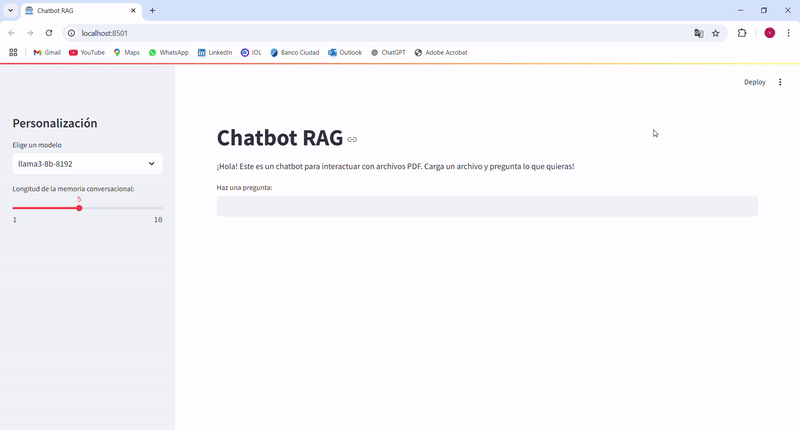
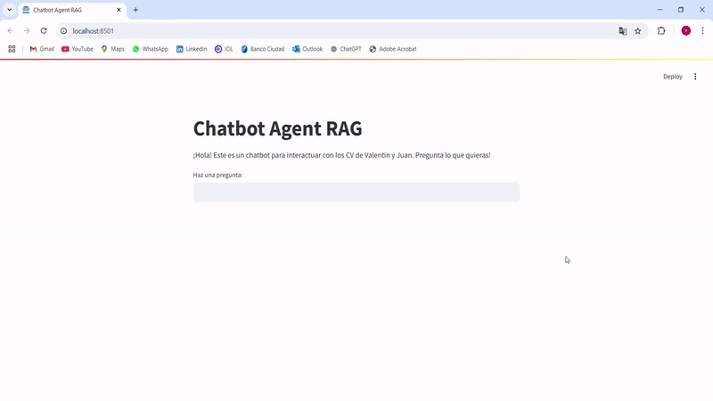

# LSE_LLM
Repositorio para subir los trabajos prácticos de la materia LLM e IA Generativa, correspondiente a la especialización en Inteligencia Artificial de la FIUBA

## TP1 Retrieval Augmented Generation (RAG)

En este trabajo práctico se implementa un sistema RAG. Como base de datos vectorial se utiliza Pinecone y como modelo de lenguaje se hace uso de la API de Groq. El documento se procesa y carga en la base de datos mediante este [notebook](https://github.com/valentinPertierra/LSE_LLM/blob/main/TP1/vectordb.ipynb), se prueba la API de Groq en este otro [notebook](https://github.com/valentinPertierra/LSE_LLM/blob/main/TP1/llm.ipynb).
Por último, se desarrolló una aplicación [web](https://github.com/valentinPertierra/LSE_LLM/blob/main/TP1/ragllm.py) con Streamlit, donde se pueden hacer consultas sobre el documento cargado en la base de datos (se utilizó mi CV).  

## TP2

En este trabajo práctico se implementó un sistema RAG con agentes, capaz de identificar la persona sobre la que se realiza una consulta, buscar la información solicitada en el documento correspondiente y generar una respuesta mediante un modelo LLM, utilizando la información extraída. Se utilizó este [notebook](https://github.com/valentinPertierra/LSE_LLM/blob/main/TP2/agent_rag.ipynb) para cargar los CV de dos personas a una base de datos vectorial de Pinecone, generar la estructura del sistema con agentes y realizar pruebas. Se desarrolló una página [web](https://github.com/valentinPertierra/LSE_LLM/blob/main/TP2/agent_rag.py) con Stremalit para realizar consultas sobre ambas personas.

## TP3 

En este [trabajo práctico](https://github.com/valentinPertierra/LSE_LLM/blob/main/TP3/TP3.ipynb) se utiliza un modelo multimodal para generar imágenes a partir de un texo. 
